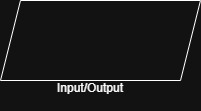

# Python-DSA

## Basics of Problem Solving
### FLowchart
1. A flowchart is a graphical representation of a process, system or algorithm.
2. It uses symbols and arrows to show the sequence of steps needed to complete a task.
3. Flow charts are useful in visualising how to solve a problem and make the process easier to follow

### Components of Flowchart
1. **Terminal**: It is the start and stop of the function.
   

2. **Input/Output**: Many problems require input and output hence to show that visually it represented as this:

3. **Process Box**: Any activity or process which is taking place this diagram is used to represent it.

4 **Decision**: The action of If or Else is represented using this diagram.

5. **Arrow**: To connect each of our components we use Arrows for the representation.

6. Connector
